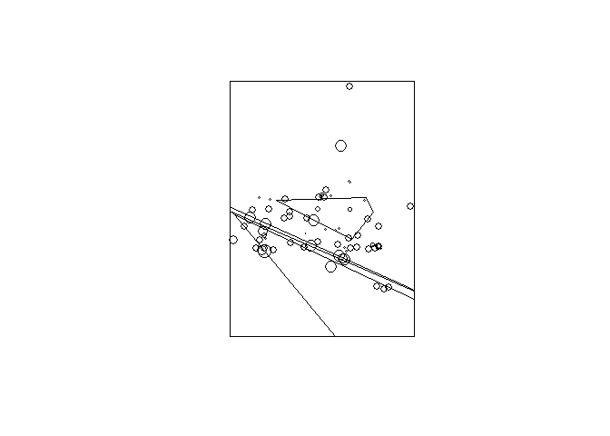

## 空间聚集丛探测常用方法

-------------------------------------------

流行病学中一个较为常见的问题就是探测疾病的空间聚集丛, 包括**热点**(hot spot)或**冷点**(cold spot), 主要分为全局性探测(Globe Detection),局部性(Local detection)探测和焦点探测(Force Decetion)。全局性探测的方法有**样方分析法**(Quadrat analysis), **最近邻分析法**(Nearest neighbor analysis), **Ripley's K 函数法**, **Cuzick-Edwards法**, **全局空间自相关分析法**(Global spatial autocorrelation analysis)和 **Tango最大超额事件检验法**；局部性探测的分析方法有**空间扫描统计量**(Spatial scan statistic), **Besag-Newell法**, **聚集性评价排列组合法**和**局部空间自相关法**;焦点探测的分析方法主要为**Stone检验法**, **Lawson-Waller得分检验法**和**Diggle检验**,各个方法的描述可参考[Here1](http://www.cnki.com.cn/Article/CJFDTOTAL-JBJC201005019.htm), [Here2](http://spatial-r.github.io/cn/2015/01/Spatial-and-Spatial-temporal/)。

--------------------------------------------------------------------------

## SPODT 简介

SPODT的全称是Spatial Oblique Decision Tree, 一种基于斜决策树(Oblique decision tree)的空间分类方法。对于空间流行病数据而言，这种非参回归方法通过递归方式在整个研究区域不断寻找阈值范围或者边界，使得不同区域内的差异尽可能大。相对于分类与回归树方法(Classification and regression tree, CART)而言，斜决策树可以将研究区域进行斜划分，而非局限的矩形(CART划分结果)。与上述局部性探测方法相比较，对该方法对边缘效应的敏感性要低很多。

--------------------------------------------------

### 方法介绍

总的说来，斜决策树是CART的改版，其函数形式如下:
$$
z-{i}=f(x_{i},y_{i})+\epsilon_{i} \\
f(x_{i},y_{i})=\sum\limits_{j=1}^{P} mz_{j}\prod{\small(x_{i},y_{i})\in{class_{j}}}
$$
其中，${x_{i},y_{i}}$是位置点$i$的经纬度，对于小区域最好采用欧几里德或地理坐标系统(**注意**:若不进行正确投影，可能会得到错误的结果)。$class_{j}$是将整个研究区域划分后形成的子区域个数，$mz_{j}$是所有子区域内样点观测值的均值。所有不同区域间的边界线($s_{j}(x_{i}+y_{i})$)是基于平行坐标系的线性函数($ax_{i}+by_{i}+c=0$)，这些边界线或是分割方向，对每个位置点(也称为结点$\xi$)进行反复迭代，最终将区域划分为若干个子区域。当结点达到如下条件时，该区域不再增加样本点:

   1. 新的区域划分不再增加变异性，也就是说该区域内新增样本点时不会产生新变异。
   2. 结点的大小不能低于事先设定好的样本点大小(parent node)。
   3. 当划分子区域时，两个子区域的大小不能低于子区域最小值(child node)。
   4. 达到分类树水平的最大值。
   
总的说来，SPODT中提供了三个重要函数，即**spodt**, **spodt.tree**, **spodtSpatialLines**,和**test.spodt**。spdot是核心函数，其中的weight, graft,level.max, min.parent, min.child和rtwo.min参数可详细控制斜分类树算法；spodt.tree和spodtSpatialLines是spdot后结果的可视化；test.spodt是采用蒙托卡罗模拟来检验分类的有效性。

----------------------------------------------------------

### 例子

此处选择了Bandiagara区域分布在168个地点的300个儿童数据，观察该人群在2009年11月-12月中疟疾的发病情况来探测是否存在疟疾高风险区。该数据集为SPODT程序包自带，因而data函数带入即可。基础分析代码如下:


```r
library(SPODT)  
data("dataMALARIA") ;coordinates(dataMALARIA) <- c("x", "y") 
proj4string(dataMALARIA) <- "+proj=longlat +datum=WGS84 +ellps=WGS84"  
dataMALARIA <- spTransform(dataMALARIA, CRS("+proj=merc +datum=WGS84 +ellps=WGS84"))
spodt.results <- spodt(z ~ 1, data = dataMALARIA, graft = 0.13,  
                       level.max = 7, min.parent = 25, min.child = 2, rtwo.min = 0.01)
spodt.tree(spodt.results)
```

 

上述即是SPODT分类树结果，设定好grapt参数值后，可得到6个子区域；其中$R_{global}^{2}$ (可通过spodt.results@R2获得)为0.49，表明疟疾发病风险中49%的差异可由空间效应来解释。


```r
SSL.result <- spodtSpatialLines(spodt.results, dataMALARIA) 
plot(SSL.result) 
points(dataMALARIA, cex = log(dataMALARIA@data$z *3))
```

 

上述即是SPODT结果以地图的方式呈现，可发现中部地区存在一个疟疾发病的低风险区(发病风险在0.08[0.04-0.11])，而在其下方存在一个发病高风险区(发病风险为0.47[0.39-0.55])


